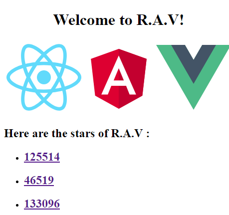

# R.A.V
React vs Angular vs Vue
> Just a fun little site to compare GitHub stars of React, Angular, and Vue


### Getting Started
To run this locally, clone the repo and use NPM to install the dependencies. (You’ll also need Node.js installed)
```bash
git clone https://github.com/januridp/rav.git
cd rav
npm install
```

### Development
Run:
```bash
ng serve
```
Start a dev server on [http://localhost:4200](http://localhost:4200)

### Production
To build for prod, run the following:
```bash
ng build --prod
```

### Inspired
[Has Vue passed React yet?](https://github.com/stursby/hasvuepassedreactyet)
